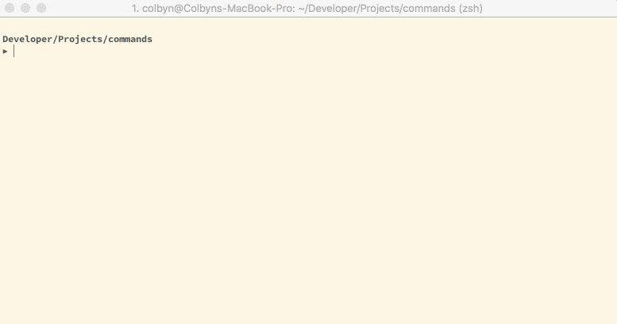

# Commands
> Just some simple and convenience tool, where something like make isn’t required.

See `./Commands`:



## A perfect example featuring the aws cli (i.e. because tool is incredibly VERBOSE).
> Notice that this is basically bash + misc. conveniences like an indentation sensitive parser.

```
# AWS Helpers

command aws::deploy do
  aws cloudformation deploy
    --template-file $(pwd)/aws-infrastructure.yaml
    --stack-name ...
    --s3-bucket ...
    --capabilities CAPABILITY_IAM CAPABILITY_NAMED_IAM

command aws::deploy::info do
  aws cloudformation deploy
    --template-file $(pwd)/aws-infrastructure.yaml
    --stack-name ...
    --s3-bucket ...
    --no-execute-changeset
    --capabilities CAPABILITY_IAM CAPABILITY_NAMED_IAM

# Build and upload our image.
command ami::build do
  linuxkit build -format vmdk -dir .linuxkit-out ./aws-image.yaml
  ami-uploader .linuxkit-out/aws-image.vmdk
```

Other examples:
```
# idk...
command publish do
  echo "Publishing..."
  silent do
    git add .
    git commit -m "auto"
    git push -u origin master
    echo "complete"
  echo "Complete."
  git --no-pager log --name-status HEAD^..HEAD | grep commit

command db::init do
  # Since Postgres doesn’t support something like “CREATE DATABASE IF NOT EXISTS”,
  # well just run the following command and discard the the error it will produce
  # if already created via the `try do <code block>` function.
  try do
    createdb services

  psql -d services -tc
    """
    CREATE EXTENSION IF NOT EXISTS "uuid-ossp"
    """

  from ./backend/services do
    stack build
    stack exec provision-db
  echo "Setup complete."

command run-chrome do
  # Usually commands ending with an ‘_’ will redirect stdout/stderr to `/dev/null`.
  run_ "/Applications/Google Chrome.app/Contents/MacOS/Google Chrome"
      --app=http://127.0.0.1:3000
      --auto-open-devtools-for-tabs

command test do
  # should this be something like `let lorem = ...`?
  lorem <- echo "lorem ipsum"
  parallel do
    echo "first"
    echo "second"
    silent echo "third"
  echo "done"
```

